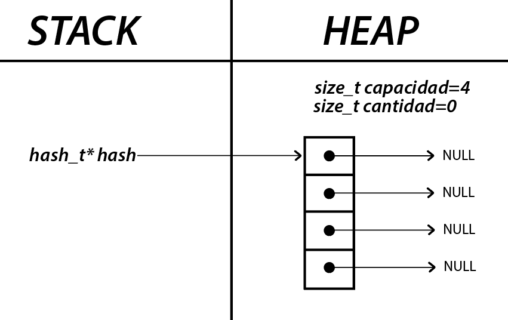
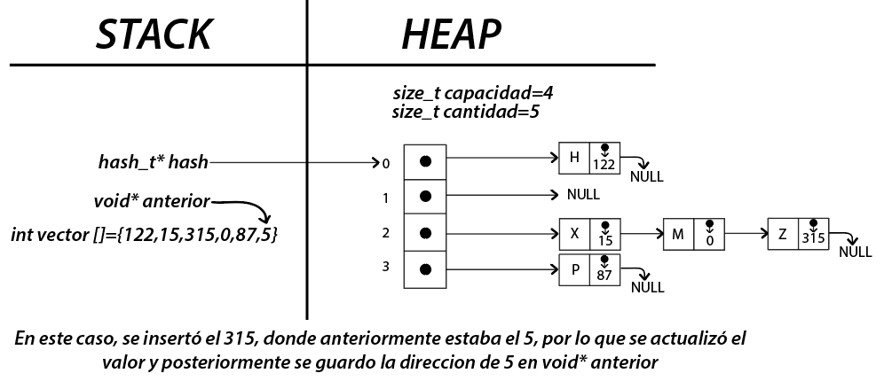
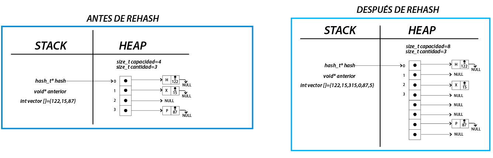
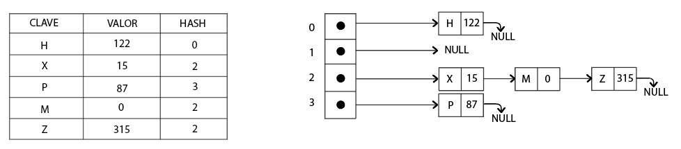
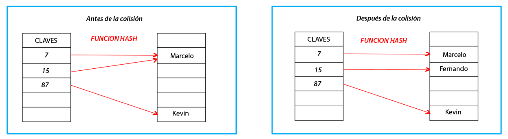

<div align="right">

</div>

# TDA HASH

## Repositorio de Thiago Fernando Baez - 110703 - thiago_fer2@hotmail.com

- Para compilar:

```bash
make pruebas_chanutron
```

- Para ejecutar:

```bash
./pruebas_chanutron
```

- Para ejecutar con valgrind:
```bash
valgrind ./pruebas_chanutron
```
---
##  Funcionamiento

Para el funcionamiento del TDA Hash se procede a dar una explicación básica de cada una de las funciones implementadas.

Se implementaron dos estructuras: 

- struct hash: Contiene un puntero a una tabla de hash, un size_t con la capacidad del mismo y otro size_t con la cantidad de elementos presentes en el hash.

- struct nodo_hash: Entre tantas opciones, se decidió implementar el hash abierto, almacenando las colisiones en nodos simplemente enlazados, guardando las colisiónes atrás del último nodo colisionado. Cada nodo contendrá un string con la clave, y un void* con el valor o elemento relacionado a la clave, y un puntero al nodo siguiente.


### hash_crear()

Para el funcionamiento del Hash, se reserva un bloque de memoria contiguo en el Heap para la tabla de hash. La capacidad inicial de la tabla es introducida por el usuario. Si la capacidad es menor a 3, se creará una tabla con capacidad igual a 3.



### hash_insertar()

Para insertar un par (clave,valor) en el hash, es necesario una función que transforme la clave en una posicion válida de la tabla, para asi poder almacenar dicho par en la posición indicada. La función que se utilizó, suma todos los caracteres de la clave. Para que esta cuenta de un número de posición válido en la tabla, se utiliza el operador `%`, que devuelve el resto de la división entera por la capacidad.

En el caso de que la clave introducida ya exista dentro del hash, se busca el valor asocidado a esa clave y se lo reemplaza con el nuevo valor insertado. El valor anterior es almacenado en un puntero que el usuario pasa por referencia. (En caso de que el puntero sea NULL, se actualiza la clave sin almacenar el valor anterior).



Como el usuario especifica la capacidad del mismo a la hora de crear el hash, a medida que se van insertando pares de clave y valor, se comienzan a producir colisiónes. Al insertar, la función hash puede devolver una posicion donde ya se encuentra un par guardado, por lo que se almacenará detrás del mismo en la última posición. Para evitar que la tabla posea muchos más pares guardados que posiciónes libres, se implementó la funcion `rehash()`. Esta crea una nueva tabla, con el doble de capacidad que la tabla anterior, y reinserta todos los pares en las nuevas posiciónes correspondientes brindadas por la función hash. El rehash ocurrirá siempre que el factor de carga máximo supere 0.7, es decir, cuando dividir la cantidad de elementos por la capacidad sea mayor 0.7.



Para la creación del nodo a insertar, se copia la clave en el heap, para así evitar que si el usuario cambia la clave en el stack, esta no se cambie en el heap y se pierda el acceso a esta. Luego se inserta en la posición correspondiente (si ya está ocupado, se almacena la colisión detrás de este).


### hash_quitar()

Esta función quita un par clave valor del hash. Busca en la tabla, en posición donde la función hash asegura que este se puede encontrar. En el caso de encontrar el elemento, se libera la memoria ocupada por la clave, por el nodo y posteriormente se retorna el valor almacenado. En caso de que no se encuentre en la posición que retorna la función hash, se asume que el par no existe en el hash y se retorna NULL. Esto se debe a que en un hash abierto (direccionamiento cerrado), se asegura que la única posición de la tabla donde se puede encontrar un par clave valor es en la que la retorna la función de hash. 

### hash_obtener()

Esta función devuelve el valor asociado a una clave que el usuario proporciona. Se hashea la clave y se busca en la posición indicada, en todos los nodos colisionados que pueda haber. En caso de encontrar la clave buscada, se retorna el valor asociado a esta. En caso de no encontrar la clave que el usuario introdució, se retorna NULL como señal de que esta clave no existe en el hash.


### hash_contiene()

Esta función busca si una clave se encuentra en el hash o no, en el caso de que exista, devuelve `true`, y en caso contrario, `false`.

### hash_cantidad()

Simplemente, devuelve la cantidad de elementos presentes en el hash, en el caso de que el hash sea nulo, devuelve 0.

### hash_destruir()

Destruye el hash liberando la memoria reservada.

### hash_con_cada_clave()

Recorre cada una de las claves almacenadas en la tabla de hash e invoca a la función f, pasandole como parámetros la clave, el valor asociado a la clave y el puntero auxiliar.
Mientras que queden mas claves o la funcion retorne true, la iteración continúa. Cuando no quedan mas claves o la función devuelve false, la iteración se corta y la función principal retorna. Devuelve la cantidad de claves totales iteradas (la cantidad de veces que fue invocada la función) o 0 en caso de error.

---

## Respuestas a las preguntas teóricas

### Qué es un diccionario

Un **diccionario** se refiere a una estructura de datos que almacena elementos en pares clave-valor. Cada elemento tiene una clave única que actúa como un identificador y un valor asociado que contiene la información o el dato correspondiente. Es similar a un diccionario en el sentido de que puedes buscar un término (clave) y encontrar su significado (valor).
El uso de diccionarios es beneficioso en situaciones donde es necesario realizar búsquedas eficientes por claves únicas, ya que la búsqueda en un diccionario suele tener un rendimiento constante en comparación con otras estructuras de datos.

### Qué es una función de hash y qué características debe tener

Una función de hash es una función matemática que toma una entrada y devuelve un valor hasheado. La idea principal es que la función de hash debe ser rápida de calcular y producir un resultado que sea difícil de revertir o predecir. 

Las características que una buena función de hash debe tener incluyen:

- La misma entrada siempre debe dar como resultado el mismo valor hash. 

- La función de hash debe ser eficiente en términos de tiempo de cálculo.

- Idealmente, las entradas diferentes deberían producir valores hash diferentes. Además, una buena función de hash intenta distribuir los valores hash de manera uniforme en el espacio de salida, para evitar colisiones.

- Un cambio pequeño en la entrada debe producir un cambio significativo en el valor hash. Este fenómeno es importante para garantizar que cambios pequeños en los datos resulten en diferencias sustanciales en los valores hash. 

- Una buena función de hash debe minimizar la probabilidad de colisiones. 

### Qué es una tabla de Hash y los diferentes métodos de resolución de colisiones vistos (encadenamiento, probing, zona de desborde)

Una tabla de hash es una estructura de datos que utiliza una función de hash para asignar claves a ubicaciones específicas en la tabla. El objetivo es proporcionar un acceso rápido a los datos mediante la búsqueda de la clave en la tabla y calcular la posición correspondiente a través de la función de hash.

En el contexto de las tablas de hash, las colisiones ocurren cuando dos claves diferentes producen el mismo valor de hash y, por lo tanto, deben ser asignadas a la misma posición en la tabla. Existen varios métodos para manejar las colisiones, y los tres principales son:

**Encadenamiento (Chaining)**: En este método, utilizado en este TP, cada posición de la tabla contiene una serie de nodos enlazados (o alguna otra estructura de datos externa) que almacena todos los elementos que han colisionado en esa posición. Cuando ocurre una colisión, se agrega el nuevo par clave valor luego último nodo existente en esa posición. Al buscar un elemento, la tabla primero calcula la posición con la función de hash y luego busca en los nodos en esa posición (o en la estructura de datos externa que se haya decidido utilizar).



**Probing lineal**: En lugar de utilizar estructuras de datos adicionales, este método intenta encontrar la siguiente posición disponible en la tabla cuando ocurre una colisión. El probing lineal busca la siguiente posición de manera lineal hasta encontrar una posición vacía y almacena en esa posición el valor correspondiente.



**Zona de desbordamiento (Overflow Area)**: En este método, se asigna una "zona de desbordamiento" adicional donde se almacenan los elementos que han causado colisiones. Cuando se produce una colisión, el elemento se coloca en la zona de desbordamiento en lugar de la posición calculada inicialmente. Al buscar un elemento, si la posición calculada tiene una colisión, se busca en la zona de desbordamiento.


